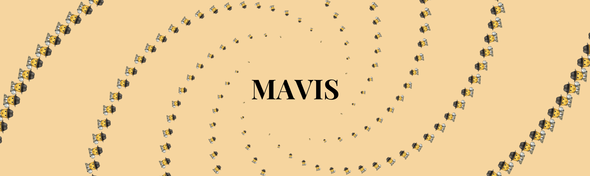
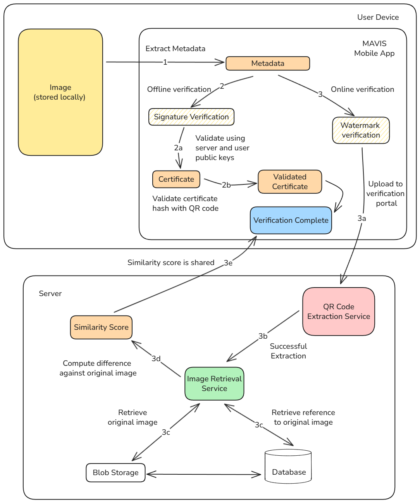

# Project MAVIS



<p align="center">
  <strong>Media Authentication, Verification and Integrity System</strong>
</p>

<p align="center">
  
  
  
</p>

---

MAVIS (Media Authentication, Verification and Integrity System) is an image steganography toolkit that uses advanced **wavelet-based DCT watermarking** combined with **QR codes**, **Reed-Solomon Encoding** and **GAN-based watermarking** to embed invisible, tamper-resistant data into images. The project provides a web-based Gradio UI for embedding, extracting, and benchmarking watermarks.

> [!NOTE]  
> We are still awaiting the publish of our research paper behind this project which was presented at the MIND 2025 conference.

### Key Features

- 🔐 **Cryptographic Image Signing** - Device-level image hash signing with RSA key pairs.
- 🌊 **Wavelet-DCT Watermarking** - Resilient invisible watermarks that survive compression and social media sharing.
- 📱 **QR Code Embedding** - Encodes provenance data in QR codes embedded as watermarks.
- 📜 **Certificate Generation** - Creates tamper-proof certificates with timestamps, user info, and device data.
- ✅ **Image Verification** - Extracts and validates embedded watermarks and certificates.

---

## 🏗️ Architecture



---

## Quick Start

### Prerequisites

- Python 3.10+
- [uv](https://docs.astral.sh/uv/) (recommended) or pip
- ZBar library (for QR code reading)

### Installation

#### Using uv (Recommended)

```bash
# Clone the repository
git clone git@github.com:Project-MAVIS/MAVIS.git
cd MAVIS

# Install dependencies
make install

# Start the Gradio web UI
python3 -m mavis.demo.demo_ui
```

The UI will be available at `http://localhost:7860`

#### Using pip

```bash
# Clone the repository
git clone <repository-url>
cd MAVIS

# Create virtual environment
python -m venv .venv
source .venv/bin/activate  # On Windows: .venv\Scripts\activate

# Install the project
pip install -e .

# Start the Gradio web UI
python -m mavis.cmd.ui
```

### ZBar Library Setup

ZBar is required for opencv2 to detect Reed-Solomon code during extraction.

**macOS:**

```bash
brew install zbar
export DYLD_LIBRARY_PATH=$(brew --prefix zbar)/lib:$DYLD_LIBRARY_PATH
```

**Ubuntu/Debian:**

```bash
sudo apt-get install libzbar0
```

**Windows:**

ZBar is included via the `pyzbar` package - no additional installation needed.

---

## 🖥️ Usage

### Web UI

Launch the Gradio interface:

```bash
# Using make
make run

# Or directly
python -m mavis.cmd.ui

# With options
python -m mavis.cmd.ui --host 0.0.0.0 --port 8080 --share
```

**UI Options:**

| Option    | Description                    | Default     |
| --------- | ------------------------------ | ----------- |
| `--host`  | Host to bind to                | `127.0.0.1` |
| `--port`  | Port to bind to                | `7860`      |
| `--share` | Create a public shareable link | `false`     |
| `--debug` | Enable debug mode              | `false`     |

### UI Tabs

1. **Embed Watermark** - Upload an image, enter payload text, and generate a watermarked image
2. **Extract Payload** - Upload a watermarked image to extract the hidden payload
3. **Benchmark** - Compare original and watermarked images, calculate quality metrics (PSNR, SSIM, BER)

---

## 🧪 Development

### Available Make Commands

```bash
make help        # Show all available commands
make install     # Install all dependencies (including dev and test)
make sync        # Sync dependencies with pyproject.toml
make run         # Run the Gradio app
make run-gradio  # Alias for run
make format      # Format code with black
make lint        # Run code quality checks
make test        # Run tests with pytest
make clean       # Clean temporary files and caches
```

### Project Structure

```
MAVIS/
├── mavis/                      # Main package
│   ├── algorithms/             # Steganography algorithms
│   │   ├── core/               # Core utilities
│   │   │   ├── qr_code.py      # QR code generation & DWT-DCT embedding
│   │   │   └── reed_solomon.py # Reed-Solomon error correction
│   │   ├── qr_steganography.py # QR-based steganography method
│   │   ├── rs_steganography.py # Reed-Solomon steganography method
│   │   └── steganography_interface.py  # Abstract base class
│   ├── benchmark/              # Benchmarking utilities
│   │   └── benchmark.py
│   ├── cmd/                    # Command-line interface
│   │   └── ui.py               # UI launcher entry point
│   └── ui/                     # Gradio web interface
│       └── ui.py               # Main Gradio app
├── scripts/                    # Setup scripts
│   ├── keys.sh                 # RSA key pair generation
│   └── setup.sh                # Legacy setup script
├── scratch/                    # Experimental/demo code
├── pyproject.toml              # Project configuration & dependencies
├── Makefile                    # Development commands
└── uv.lock                     # Dependency lock file
```

---

## 🔬 Technical Details

### Watermarking Algorithm

MAVIS uses a **Wavelet-DCT (Discrete Cosine Transform)** hybrid approach:

1. **Wavelet Decomposition** - Image is decomposed using PyWavelets (DWT)
2. **QR Code Generation** - Payload data is encoded into a QR code
3. **DCT Transform** - Applied to wavelet subband coefficients
4. **Embedding** - QR code is embedded in mid-frequency coefficients (robust to compression)
5. **Reconstruction** - Image is reconstructed with minimal visual artifacts

### Default Parameters

| Parameter     | Default Value | Description                     |
| ------------- | ------------- | ------------------------------- |
| `alpha`       | `25.0`        | Embedding strength              |
| `wavelet`     | `db4`         | Wavelet type (Daubechies-4)     |
| `subband`     | `HL`          | Wavelet subband for embedding   |
| `repetitions` | `1`           | Number of embedding repetitions |

### Resilience Features

- ✅ JPEG compression (up to 70% quality)
- ✅ Social media compression (WhatsApp, Instagram)
- ✅ Minor cropping and resizing
- ✅ Color adjustments

### Certificate Structure

```
┌──────────────────────────────────────────────┐
│ cert_len │ timestamp │ image_id │ user_id   │
│ device_id │ username │ device_name           │
└──────────────────────────────────────────────┘
```

### Quality Metrics

The benchmark tab calculates:

- **PSNR** (Peak Signal-to-Noise Ratio) - Image quality metric
- **SSIM** (Structural Similarity Index) - Perceptual quality metric
- **BER** (Bit Error Rate) - Payload accuracy
- **Exact Match** - Whether extracted payload matches original

---

## 🤝 Contributing

1. Fork the repository
2. Create a feature branch (`git checkout -b feature/amazing-feature`)
3. Commit your changes (`git commit -m 'Add amazing feature'`)
4. Push to the branch (`git push origin feature/amazing-feature`)
5. Open a Pull Request

---

## 👥 Authors

- **Omkar Wagholikar** - [omkarrwagholikar@gmail.com](mailto:omkarrwagholikar@gmail.com)
- **Shantanu Wable** - [shantanuwable2003@gmail.com](mailto:shantanuwable2003@gmail.com)
- **Soaham Pimparkar** - [soahampimparkar@gmail.com](mailto:soahampimparkar@gmail.com)
- **Chinmay Patil** - [crpatil1901@gmail.com](mailto:crpatil1901@gmail.com)

---

## 📄 License

This project is licensed under the MIT License - see the [LICENSE](LICENSE) file for details.

---

## 🙏 Acknowledgments

- [PyWavelets](https://pywavelets.readthedocs.io/) - Wavelet transforms
- [Gradio](https://gradio.app/) - Web UI framework
- [QReader](https://github.com/Eric-Canas/qreader) - QR code reading
- [Pillow](https://python-pillow.org/) - Image processing
- [scikit-image](https://scikit-image.org/) - Image quality metrics.

[^1]: The majority of the code in this repository was written during development, in [another repository](https://github.com/Project-MAVIS/Backend), but was later ported to this repository for better organization and to keep the codebase clean.
